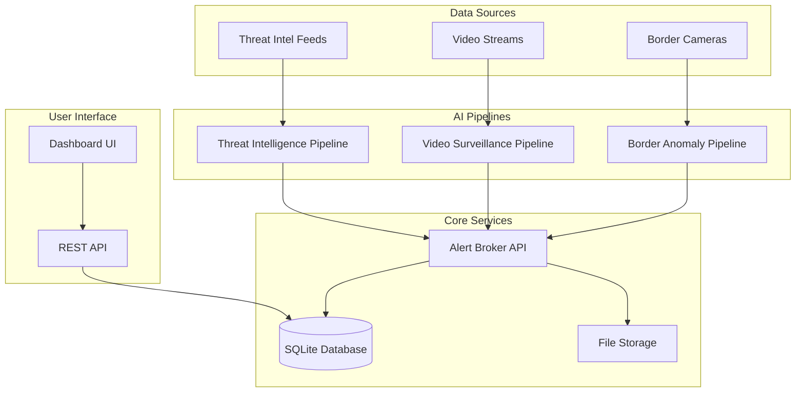

# HifazatAI Prototype Design Document

## Overview

HifazatAI is a modular security AI system built around three core detection pipelines that feed into a unified alert management system. The architecture follows a microservices approach with each pipeline operating independently while sharing common infrastructure for data storage, API services, and visualization.

The system is designed for rapid prototyping with Python-based components, leveraging pre-trained models and transfer learning to achieve target performance metrics within the one-month development timeline.

## Architecture

### High-Level System Architecture



### Technology Stack

**Core Framework:**
- Python 3.10+ for all components
- Docker for containerization (optional for prototype)
- Git for version control

**Machine Learning & Computer Vision:**
- PyTorch for deep learning models
- Ultralytics YOLOv8 for object detection
- OpenCV for video processing
- DeepSORT for object tracking
- scikit-learn for traditional ML algorithms
- HuggingFace Transformers for NLP models

**Backend Services:**
- FastAPI for REST API development
- SQLite for data persistence
- Pydantic for data validation

**Frontend & Visualization:**
- Streamlit for rapid dashboard development
- Plotly for interactive charts
- PIL/OpenCV for image processing

**Optional Components:**
- Redis for caching and pub/sub (if streaming required)
- MQTT for IoT device communication

## Components and Interfaces

### 1. Threat Intelligence Pipeline

**Purpose:** Process threat intelligence feeds and extract high-risk indicators

**Key Components:**
- **Feed Ingester:** Handles multiple input formats (JSON, CSV, XML)
- **IOC Extractor:** Uses regex patterns and spaCy NER for entity extraction
- **Risk Classifier:** DistilBERT-based classifier with TF-IDF features
- **Alert Generator:** Produces structured JSON alerts

**Input Interface:**
```python
class ThreatFeed:
    source: str
    format: str  # json, csv, xml
    data: Union[Dict, List, str]
    timestamp: datetime
```

**Output Interface:**
```python
class ThreatAlert:
    id: str
    timestamp: datetime
    type: str  # ip, domain, hash, cve
    value: str
    risk_score: float
    confidence: float
    source: str
    evidence: Dict
```

**Processing Flow:**
1. Ingest feeds from configured sources
2. Parse and normalize data format
3. Extract IOCs using NLP and regex
4. Classify risk level using ensemble model
5. Generate structured alerts
6. Send to Alert Broker

### 2. Video Surveillance Pipeline

**Purpose:** Analyze video streams for object detection, tracking, and behavior analysis

**Key Components:**
- **Object Detector:** YOLOv8 model for person/vehicle/object detection
- **Object Tracker:** DeepSORT for multi-object tracking
- **Behavior Analyzer:** Rule-based system for suspicious activity detection
- **Frame Processor:** Handles video input/output and frame management

**Input Interface:**
```python
class VideoInput:
    source: str  # file path or stream URL
    fps: int
    resolution: Tuple[int, int]
    format: str
```

**Output Interface:**
```python
class VideoAlert:
    id: str
    timestamp: datetime
    event_type: str  # loitering, zone_violation, abandoned_object
    confidence: float
    bounding_box: List[int]
    track_id: int
    snapshot: str  # base64 encoded image
    metadata: Dict
```

**Processing Flow:**
1. Capture video frames from input source
2. Run object detection on each frame
3. Update object tracks using DeepSORT
4. Apply behavior rules to track history
5. Generate alerts for suspicious events
6. Store snapshots and send alerts to broker

### 3. Border Anomaly Detection Pipeline

**Purpose:** Detect unusual movement patterns and behaviors in border surveillance

**Key Components:**
- **Trajectory Extractor:** Computes movement paths from tracking data
- **Feature Computer:** Calculates speed, curvature, duration metrics
- **Anomaly Detector:** Isolation Forest or autoencoder for anomaly detection
- **Motion Analyzer:** Fallback motion-based detection system

**Input Interface:**
```python
class BorderVideo:
    source: str
    region_of_interest: List[Tuple[int, int]]
    normal_patterns: Optional[List[Dict]]
```

**Output Interface:**
```python
class AnomalyAlert:
    id: str
    timestamp: datetime
    anomaly_type: str
    severity_score: float
    trajectory: List[Tuple[int, int]]
    features: Dict
    supporting_frames: List[str]
```

**Processing Flow:**
1. Extract object trajectories from video
2. Compute trajectory features (speed, curvature, etc.)
3. Run unsupervised anomaly detection
4. Score anomalies and filter by threshold
5. Generate alerts with supporting evidence
6. Send to Alert Broker

### 4. Alert Broker Service

**Purpose:** Centralized alert collection, storage, and distribution

**Key Components:**
- **Alert Receiver:** REST endpoints for pipeline alerts
- **Data Validator:** Pydantic models for alert validation
- **Storage Manager:** SQLite database operations
- **Query Engine:** Alert retrieval and filtering

**API Endpoints:**
```python
POST /alerts/threat
POST /alerts/video  
POST /alerts/anomaly
GET /alerts?type=&start_time=&end_time=&limit=
GET /alerts/{alert_id}
PUT /alerts/{alert_id}/status
```

**Database Schema:**
```sql
CREATE TABLE alerts (
    id TEXT PRIMARY KEY,
    pipeline TEXT NOT NULL,
    type TEXT NOT NULL,
    timestamp DATETIME NOT NULL,
    confidence REAL,
    data JSON,
    status TEXT DEFAULT 'active',
    created_at DATETIME DEFAULT CURRENT_TIMESTAMP
);

CREATE TABLE alert_media (
    id TEXT PRIMARY KEY,
    alert_id TEXT REFERENCES alerts(id),
    media_type TEXT,
    file_path TEXT,
    created_at DATETIME DEFAULT CURRENT_TIMESTAMP
);
```

### 5. Dashboard Interface

**Purpose:** Web-based interface for monitoring alerts and system status

**Key Components:**
- **Alert Monitor:** Real-time alert display with filtering
- **Video Viewer:** Embedded video player with overlay annotations
- **System Status:** Pipeline health and performance metrics
- **Alert Manager:** Tools for alert review and status updates

**Dashboard Sections:**
1. **Live Alerts Feed:** Scrolling list of recent alerts
2. **Alert Details Panel:** Detailed view with evidence and metadata
3. **Video Playback:** Frame-by-frame analysis with bounding boxes
4. **System Metrics:** Processing rates, accuracy scores, uptime
5. **Configuration Panel:** Threshold adjustments and pipeline settings

## Data Models

### Core Data Structures

```python
from pydantic import BaseModel
from datetime import datetime
from typing import List, Dict, Optional, Union

class BaseAlert(BaseModel):
    id: str
    timestamp: datetime
    confidence: float
    source_pipeline: str
    status: str = "active"

class ThreatAlert(BaseAlert):
    ioc_type: str
    ioc_value: str
    risk_level: str
    evidence_text: str
    source_feed: str

class VideoAlert(BaseAlert):
    event_type: str
    bounding_box: List[int]
    track_id: int
    snapshot_path: str
    video_timestamp: float

class AnomalyAlert(BaseAlert):
    anomaly_type: str
    severity_score: float
    trajectory_points: List[List[int]]
    feature_vector: List[float]
    supporting_frames: List[str]

class SystemMetrics(BaseModel):
    pipeline_name: str
    processing_rate: float
    accuracy_score: Optional[float]
    last_update: datetime
    status: str
```

### Configuration Models

```python
class PipelineConfig(BaseModel):
    enabled: bool
    confidence_threshold: float
    processing_interval: int

class ThreatConfig(PipelineConfig):
    feed_sources: List[str]
    risk_thresholds: Dict[str, float]
    model_path: str

class VideoConfig(PipelineConfig):
    input_sources: List[str]
    detection_classes: List[str]
    tracking_enabled: bool
    behavior_rules: Dict[str, Dict]

class AnomalyConfig(PipelineConfig):
    sensitivity: float
    min_trajectory_length: int
    feature_weights: Dict[str, float]
```

## Error Handling

### Error Categories and Responses

**1. Input Validation Errors**
- Invalid video format or corrupted files
- Malformed threat intelligence feeds
- Missing required configuration parameters

**Response Strategy:**
- Log detailed error information
- Return structured error responses via API
- Continue processing other inputs when possible
- Provide fallback mechanisms for critical components

**2. Model Inference Errors**
- CUDA out of memory errors
- Model loading failures
- Inference timeout errors

**Response Strategy:**
- Implement automatic fallback to CPU processing
- Use model checkpointing for recovery
- Implement circuit breaker pattern for failing models
- Graceful degradation with reduced functionality

**3. System Resource Errors**
- Disk space limitations
- Memory exhaustion
- Network connectivity issues

**Response Strategy:**
- Implement resource monitoring and alerts
- Automatic cleanup of old data
- Retry mechanisms with exponential backoff
- Health check endpoints for monitoring

### Error Logging and Monitoring

```python
import logging
from enum import Enum

class ErrorSeverity(Enum):
    LOW = "low"
    MEDIUM = "medium"
    HIGH = "high"
    CRITICAL = "critical"

class ErrorHandler:
    def __init__(self):
        self.logger = logging.getLogger(__name__)
    
    def handle_error(self, error: Exception, severity: ErrorSeverity, context: Dict):
        error_data = {
            "timestamp": datetime.now(),
            "error_type": type(error).__name__,
            "message": str(error),
            "severity": severity.value,
            "context": context
        }
        
        self.logger.error(f"Error occurred: {error_data}")
        
        if severity in [ErrorSeverity.HIGH, ErrorSeverity.CRITICAL]:
            self.send_alert(error_data)
```

## Testing Strategy

### Unit Testing

**Scope:** Individual components and functions
**Framework:** pytest with fixtures for mock data
**Coverage Target:** 80% code coverage minimum

**Key Test Areas:**
- IOC extraction accuracy with known samples
- Object detection precision on labeled frames
- Anomaly detection recall on synthetic data
- API endpoint functionality and error handling
- Database operations and data integrity

### Integration Testing

**Scope:** End-to-end pipeline functionality
**Framework:** pytest with Docker containers for services

**Test Scenarios:**
- Complete threat intelligence processing workflow
- Video analysis from input to alert generation
- Multi-pipeline alert aggregation and storage
- Dashboard functionality with real-time updates
- System recovery after component failures

### Performance Testing

**Scope:** System performance under load
**Framework:** pytest-benchmark and custom load generators

**Metrics to Measure:**
- Processing latency for each pipeline
- Throughput under concurrent load
- Memory usage patterns
- Database query performance
- API response times

### Evaluation Testing

**Scope:** ML model accuracy and system metrics
**Framework:** Custom evaluation scripts with labeled datasets

**Evaluation Components:**
```python
class ModelEvaluator:
    def evaluate_threat_intelligence(self, test_data: List[ThreatSample]) -> Dict:
        # Precision, recall, F1 for threat classification
        pass
    
    def evaluate_video_detection(self, test_videos: List[VideoSample]) -> Dict:
        # mAP, detection accuracy, tracking performance
        pass
    
    def evaluate_anomaly_detection(self, test_data: List[AnomalySample]) -> Dict:
        # Anomaly recall, false positive rate, ROC-AUC
        pass
```

### Test Data Management

**Synthetic Data Generation:**
- Automated generation of threat intelligence samples
- Synthetic video scenarios with known ground truth
- Simulated anomaly patterns for border detection

**Real Data Handling:**
- Anonymized and sanitized real-world samples
- Proper data licensing and usage agreements
- Privacy-compliant data handling procedures

## Deployment Architecture

### Development Environment

**Local Development Setup:**
```bash
# Environment setup
python -m venv hifazat-env
source hifazat-env/bin/activate
pip install -r requirements.txt

# Service startup
python -m uvicorn alert_broker:app --reload
streamlit run dashboard.py
python threat_pipeline.py
python video_pipeline.py
python anomaly_pipeline.py
```

### Production Considerations

**Containerization Strategy:**
- Separate containers for each pipeline
- Shared volume for model weights and data
- Docker Compose for orchestration
- Health checks and restart policies

**Scalability Design:**
- Horizontal scaling for video processing
- Load balancing for API endpoints
- Database connection pooling
- Asynchronous processing queues

**Security Measures:**
- API authentication and authorization
- Encrypted data transmission
- Secure model storage
- Audit logging for compliance

This design provides a solid foundation for the HifazatAI prototype while maintaining flexibility for future enhancements and production deployment.