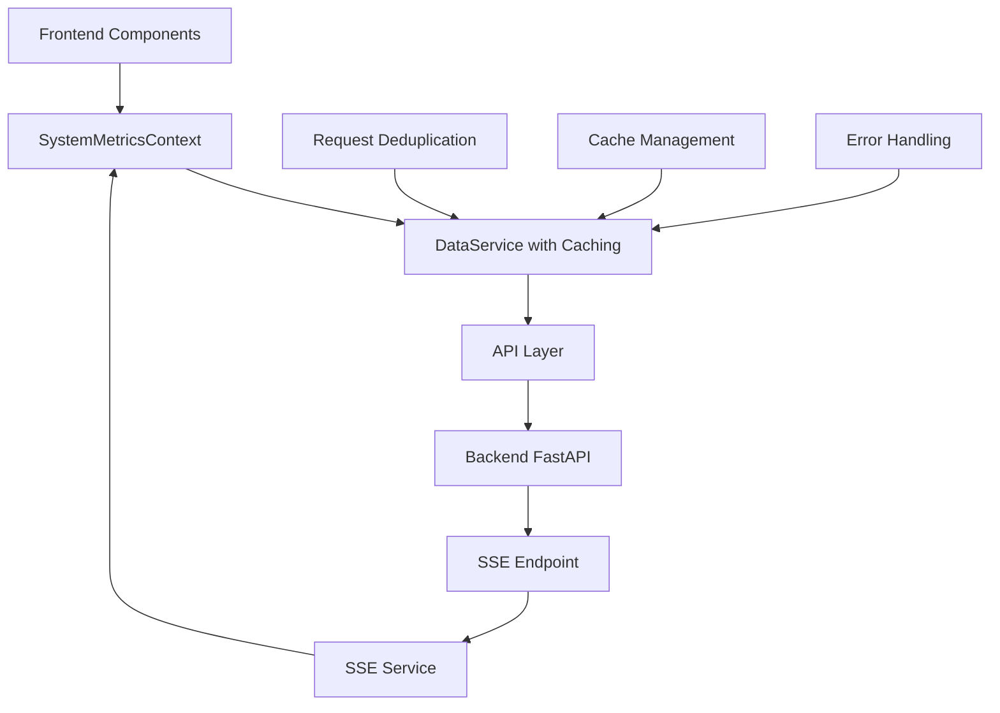
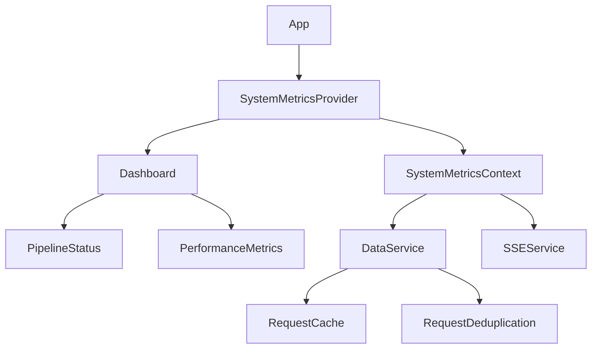
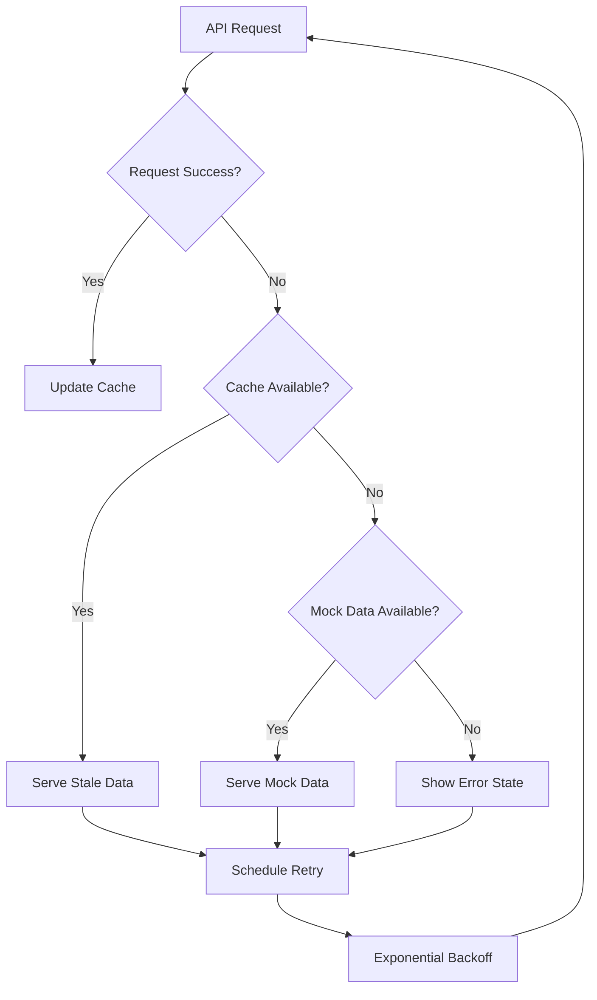

# Design Document

## Overview

This design addresses the critical monitoring system issues in HifazatAI by implementing a robust data management architecture that eliminates flickering, reduces unnecessary API requests, and provides reliable real-time monitoring capabilities. The solution focuses on intelligent caching, stable data flow, and efficient request management.

## Architecture

### Data Flow Architecture



### Component Hierarchy



## Components and Interfaces

### 1. Enhanced SystemMetricsContext

**Purpose:** Centralized state management for all monitoring data with intelligent caching and request deduplication.

**Key Features:**
- Single source of truth for system metrics
- Automatic request deduplication
- Intelligent cache invalidation
- Error state management
- Real-time update integration

**Interface:**
```typescript
interface SystemMetricsContextType {
  data: SystemMetricsData | null;
  loading: boolean;
  error: string | null;
  lastRefresh: Date | null;
  refresh: () => Promise<void>;
  isStale: boolean;
  connectionStatus: 'connected' | 'disconnected' | 'reconnecting';
}
```

### 2. Improved DataService with Smart Caching

**Purpose:** Intelligent API request management with advanced caching strategies.

**Key Features:**
- Request deduplication (prevent multiple identical requests)
- Stale-while-revalidate caching strategy
- Exponential backoff for failed requests
- Cache invalidation based on data freshness
- Shared cache across components

**Interface:**
```typescript
interface CacheStrategy {
  ttl: number; // Time to live
  staleTime: number; // Time before data is considered stale
  maxRetries: number;
  retryDelay: number;
}

interface DataServiceInterface {
  getSystemMetrics(options?: RequestOptions): Promise<SystemMetricsData>;
  invalidateCache(key?: string): void;
  getCacheStatus(key: string): CacheStatus;
  setRequestStrategy(strategy: CacheStrategy): void;
}
```

### 3. Stabilized PipelineStatus Component

**Purpose:** Display pipeline status without data regeneration or flickering.

**Key Features:**
- Stable data rendering with memoization
- Graceful fallback to cached data
- Consistent mock data when API unavailable
- Optimized re-render prevention
- Real-time status updates via SSE

**Data Structure:**
```typescript
interface StablePipelineMetrics {
  pipeline_name: string;
  status: PipelineStatus;
  processing_rate: number;
  accuracy_score?: number;
  last_update: string;
  error_count: number;
  uptime: number;
  memory_usage?: number;
  cpu_usage?: number;
  _stable_id: string; // Prevents unnecessary re-renders
}
```

### 4. Enhanced PerformanceMetrics Component

**Purpose:** Stable performance metrics visualization without flickering.

**Key Features:**
- Memoized chart data generation
- Incremental data updates
- Stable pseudo-random data for consistency
- Optimized chart rendering
- Time-series data management

**Data Management:**
```typescript
interface StableMetricDataPoint {
  timestamp: string;
  value: number;
  _id: string; // Stable identifier
}

interface PerformanceMetricConfig {
  name: string;
  baseValue: number;
  variance: number;
  seed: string; // For consistent pseudo-random generation
  updateStrategy: 'append' | 'replace' | 'merge';
}
```

### 5. Optimized SSE Service

**Purpose:** Reliable real-time updates with connection management.

**Key Features:**
- Automatic reconnection with exponential backoff
- Connection state management
- Event filtering and processing
- Heartbeat handling without UI updates
- Graceful degradation to polling

## Data Models

### SystemMetricsData Structure
```typescript
interface SystemMetricsData {
  system_status: string;
  total_alerts: number;
  alerts_today: number;
  pipelines: Record<string, PipelineData>;
  uptime: string;
  last_updated: string;
  _cache_timestamp?: number;
  _version?: string;
}

interface PipelineData {
  processing_rate: number;
  accuracy_score: number;
  status: 'online' | 'offline' | 'error' | 'warning';
  error_count: number;
  last_update: string;
  memory_usage?: number;
  cpu_usage?: number;
}
```

### Cache Management
```typescript
interface CacheEntry<T> {
  data: T;
  timestamp: number;
  expiry: number;
  staleTime: number;
  version: string;
  requestId: string;
}

interface RequestState {
  pending: boolean;
  promise?: Promise<any>;
  retryCount: number;
  lastError?: Error;
}
```

## Error Handling

### Error Categories
1. **Network Errors:** Connection failures, timeouts
2. **API Errors:** 4xx/5xx HTTP responses
3. **Data Errors:** Invalid response format, missing fields
4. **Cache Errors:** Cache corruption, storage failures

### Error Recovery Strategies
1. **Exponential Backoff:** For network failures
2. **Stale Data Serving:** Show cached data during errors
3. **Graceful Degradation:** Fall back to mock data
4. **User Notification:** Clear error messages
5. **Automatic Retry:** With circuit breaker pattern

### Error Handling Flow


## Testing Strategy

### Unit Testing
- **DataService:** Cache behavior, request deduplication, error handling
- **SystemMetricsContext:** State management, data flow
- **Components:** Stable rendering, prop changes, error states

### Integration Testing
- **API Integration:** Real backend communication
- **SSE Integration:** Real-time update flow
- **Cache Integration:** Cross-component data sharing

### Performance Testing
- **Request Optimization:** Measure request reduction
- **Render Performance:** Component re-render frequency
- **Memory Usage:** Cache memory consumption
- **Network Efficiency:** Bandwidth usage reduction

### Test Scenarios
1. **Network Interruption:** SSE disconnection and reconnection
2. **API Failures:** Backend unavailability
3. **Data Corruption:** Invalid API responses
4. **High Load:** Multiple simultaneous requests
5. **Cache Expiration:** Stale data handling

## Implementation Phases

### Phase 1: Core Infrastructure
- Enhanced DataService with caching
- Request deduplication system
- Error handling framework
- Cache management utilities

### Phase 2: Context Enhancement
- SystemMetricsContext improvements
- SSE service optimization
- Connection state management
- Real-time update integration

### Phase 3: Component Stabilization
- PipelineStatus component fixes
- PerformanceMetrics stability
- Memoization implementation
- Render optimization

### Phase 4: Testing and Optimization
- Comprehensive testing suite
- Performance monitoring
- Error scenario testing
- Production optimization

## Performance Considerations

### Request Optimization
- **Deduplication:** Prevent duplicate requests
- **Batching:** Combine related requests
- **Caching:** Intelligent cache strategies
- **Polling Reduction:** Smart refresh intervals

### Rendering Optimization
- **Memoization:** Prevent unnecessary re-renders
- **Stable Keys:** Consistent component keys
- **Data Normalization:** Consistent data structures
- **Lazy Loading:** Load components on demand

### Memory Management
- **Cache Limits:** Maximum cache size
- **Cleanup:** Automatic cache cleanup
- **Weak References:** Prevent memory leaks
- **Garbage Collection:** Efficient cleanup strategies