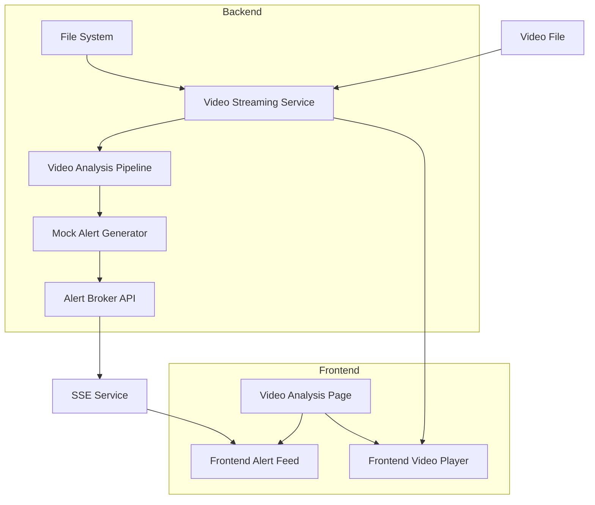

# Design Document

## Overview

This design implements real-time video streaming from backend to frontend with concurrent AI analysis and mock alert generation. The system extends the existing HifazatAI architecture to serve video files from the backend media directory while simultaneously processing them through the video surveillance pipeline. Mock alerts are generated every 30 seconds and delivered to the frontend via the existing Server-Sent Events (SSE) infrastructure.

The design leverages the existing video surveillance pipeline, FastAPI backend, React frontend, and SSE-based real-time communication system to create a prototype that simulates live CCTV monitoring.

## Architecture

### System Components



### Data Flow

1. **Video Serving**: Backend serves video files via HTTP streaming endpoint
2. **Concurrent Analysis**: Video frames are processed by the existing video surveillance pipeline
3. **Alert Generation**: Mock alerts are generated every 30 seconds based on video analysis
4. **Real-time Delivery**: Alerts are sent to frontend via existing SSE infrastructure
5. **Frontend Display**: Video plays with loop/muted attributes while alerts appear in real-time

## Components and Interfaces

### Backend Components

#### 1. Video Streaming Service
```python
class VideoStreamingService:
    def __init__(self, media_directory: str)
    async def stream_video(self, filename: str) -> StreamingResponse
    async def get_video_info(self, filename: str) -> VideoInfo
    def list_available_videos(self) -> List[VideoInfo]
```

**Responsibilities:**
- Serve video files via HTTP streaming
- Handle range requests for efficient streaming
- Provide video metadata (duration, resolution, format)

#### 2. Video Analysis Coordinator
```python
class VideoAnalysisCoordinator:
    def __init__(self, pipeline: VideoSurveillancePipeline)
    async def start_analysis(self, video_path: str) -> str
    async def stop_analysis(self, session_id: str)
    async def get_analysis_status(self, session_id: str) -> AnalysisStatus
```

**Responsibilities:**
- Coordinate video file processing with existing pipeline
- Manage analysis sessions for different videos
- Extract frames from video files for AI processing

#### 3. Mock Alert Generator
```python
class MockAlertGenerator:
    def __init__(self, alert_broker: AlertBroker)
    async def start_mock_alerts(self, session_id: str)
    async def stop_mock_alerts(self, session_id: str)
    def generate_realistic_alert(self) -> VideoAlert
```

**Responsibilities:**
- Generate mock video alerts every 30 seconds
- Create realistic alert data (bounding boxes, confidence scores, event types)
- Send alerts through existing alert broker system

### Frontend Components

#### 1. Enhanced Video Player
```typescript
interface EnhancedVideoPlayerProps {
  src: string;
  autoPlay: boolean;
  loop: boolean;
  muted: boolean;
  onAnalysisStart?: () => void;
  onAnalysisStop?: () => void;
}
```

**Enhancements:**
- Default loop and muted attributes
- Integration with analysis status indicators
- Real-time bounding box overlays from alerts

#### 2. Video Analysis Controller
```typescript
class VideoAnalysisController {
  startAnalysis(videoId: string): Promise<void>
  stopAnalysis(sessionId: string): Promise<void>
  getAnalysisStatus(sessionId: string): Promise<AnalysisStatus>
}
```

**Responsibilities:**
- Control video analysis sessions
- Display analysis status and metrics
- Handle analysis start/stop operations

### API Endpoints

#### Video Streaming Endpoints
```
GET /api/videos                    # List available videos
GET /api/videos/{filename}         # Stream video file
GET /api/videos/{filename}/info    # Get video metadata
```

#### Video Analysis Endpoints
```
POST /api/analysis/start           # Start video analysis
POST /api/analysis/stop            # Stop video analysis
GET /api/analysis/status/{id}      # Get analysis status
```

## Data Models

### Video Information
```python
class VideoInfo(BaseModel):
    filename: str
    display_name: str
    duration: float
    resolution: Tuple[int, int]
    format: str
    file_size: int
    created_at: datetime
```

### Analysis Session
```python
class AnalysisSession(BaseModel):
    session_id: str
    video_filename: str
    status: AnalysisStatus
    started_at: datetime
    frames_processed: int
    alerts_generated: int
```

### Mock Alert Data
```python
class MockVideoAlert(VideoAlert):
    # Inherits from existing VideoAlert
    mock_data: Dict[str, Any]  # Additional mock-specific data
    scenario_type: str         # Type of mock scenario
```

## Error Handling

### Video Streaming Errors
- **File Not Found**: Return 404 with clear error message
- **Unsupported Format**: Return 415 with supported formats list
- **Streaming Errors**: Implement retry logic and fallback mechanisms

### Analysis Pipeline Errors
- **Pipeline Initialization**: Graceful degradation if AI models fail to load
- **Frame Processing**: Skip corrupted frames and continue processing
- **Resource Exhaustion**: Implement queue management and processing limits

### Frontend Error Handling
- **Video Load Failures**: Display error message with retry option
- **Analysis Connection**: Show connection status and manual restart option
- **Alert Feed Errors**: Fallback to polling if SSE connection fails

## Testing Strategy

### Backend Testing
- **Unit Tests**: Video streaming service, mock alert generator
- **Integration Tests**: End-to-end video analysis workflow
- **Performance Tests**: Concurrent video streaming and analysis
- **Load Tests**: Multiple simultaneous analysis sessions

### Frontend Testing
- **Component Tests**: Enhanced video player with mock data
- **Integration Tests**: Video analysis page with real backend
- **User Experience Tests**: Video playback quality and alert responsiveness
- **Cross-browser Tests**: Video streaming compatibility

### System Testing
- **End-to-End Tests**: Complete video streaming and alert workflow
- **Real-time Tests**: SSE alert delivery timing and reliability
- **Resource Tests**: Memory and CPU usage during video processing
- **Scalability Tests**: Multiple concurrent video streams

## Performance Considerations

### Video Streaming Optimization
- **HTTP Range Requests**: Support partial content delivery
- **Caching Headers**: Implement appropriate cache control
- **Compression**: Use efficient video codecs and streaming protocols
- **Bandwidth Management**: Adaptive streaming based on connection quality

### Analysis Pipeline Optimization
- **Frame Sampling**: Process every Nth frame to reduce CPU load
- **Batch Processing**: Group frame processing for efficiency
- **Resource Limits**: Set maximum concurrent analysis sessions
- **Memory Management**: Implement frame buffer cleanup

### Frontend Performance
- **Video Buffering**: Optimize buffer size for smooth playback
- **Alert Rendering**: Efficient DOM updates for real-time alerts
- **Memory Leaks**: Proper cleanup of video and analysis resources
- **UI Responsiveness**: Non-blocking operations for analysis controls

## Security Considerations

### Video Access Control
- **File Path Validation**: Prevent directory traversal attacks
- **Access Permissions**: Verify user authorization for video access
- **Content Type Validation**: Ensure only video files are served
- **Rate Limiting**: Prevent abuse of streaming endpoints

### Analysis Security
- **Input Validation**: Sanitize video file inputs
- **Resource Limits**: Prevent DoS through excessive analysis requests
- **Session Management**: Secure analysis session identifiers
- **Data Privacy**: Ensure video content is not logged or cached inappropriately

## Deployment Considerations

### Development Environment
- **Docker Integration**: Update docker-compose for video streaming
- **Volume Mounts**: Ensure video files are accessible in containers
- **Environment Variables**: Configure video directory paths
- **Development Tools**: Hot reload for video analysis components

### Production Environment
- **CDN Integration**: Serve videos through content delivery network
- **Load Balancing**: Distribute video streaming across multiple instances
- **Storage Optimization**: Efficient video file storage and retrieval
- **Monitoring**: Track video streaming performance and analysis metrics

## Future Extensibility

### Live CCTV Integration
- **Stream Protocols**: Support RTSP, WebRTC, and other live protocols
- **Camera Management**: Device discovery and configuration
- **Multi-stream Support**: Concurrent processing of multiple live feeds
- **Recording Integration**: Seamless transition between live and recorded content

### Advanced Analysis Features
- **Real-time Processing**: Frame-by-frame analysis of live streams
- **Multi-pipeline Support**: Integrate threat intelligence and anomaly detection
- **Custom Alert Rules**: User-configurable alert conditions
- **Analytics Dashboard**: Historical analysis and trend reporting